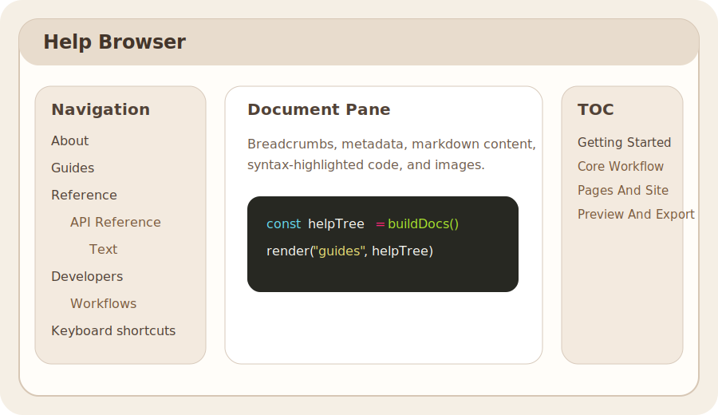

# Getting Started

This is the beginning of the editor guide for Editor Playground.

The goal of this section is to grow into task-oriented documentation for real authoring work: creating pages, structuring content, editing on stage, previewing behavior, and exporting the result.

## What This Guide Will Become

- first-session orientation for the editor shell
- step-by-step authoring flows
- page and navigation setup
- preview and export checks

## Current Starting Points

- [Reference Overview](./REFERENCE.md)
- [API Reference](./API.md)
- [Developers Overview](./DEVELOPERS.md)

## Placeholder

Detailed editor-guide pages still need to be written. This page is the first placeholder under `Guides` and should expand into a real manual over time.
